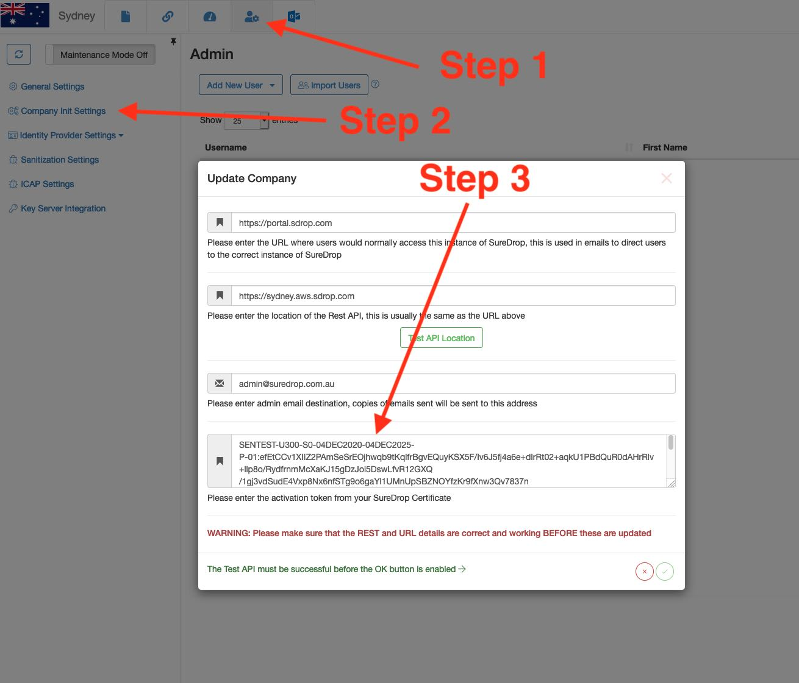

Open Application
================

Contact the `sales <https://www.sdrop.com/#contact>`_ team to obtain a
license certificate for SureDrop `SaaS <https://www.sdrop.com>`_
instance containing:

-  Company name
-  User name
-  URL

Navigate to the given URL in your browser and click on the :guilabel:`Forgot password` link
below the password field. This will bring up a ``Reset your password`` page. Enter the Company
and User name given in your license file and click :guilabel:`Send` You will get your password 
activation token in your email. Clicking on the link in your email will allow you to setup your 
password and login to the system.

.. Note::
   The default administrator email address is the one you sent when you applied for the license
   certificate. This can be changed after the first login from the admin page.

Once logged in please enter the Activation Token by following the steps below.

