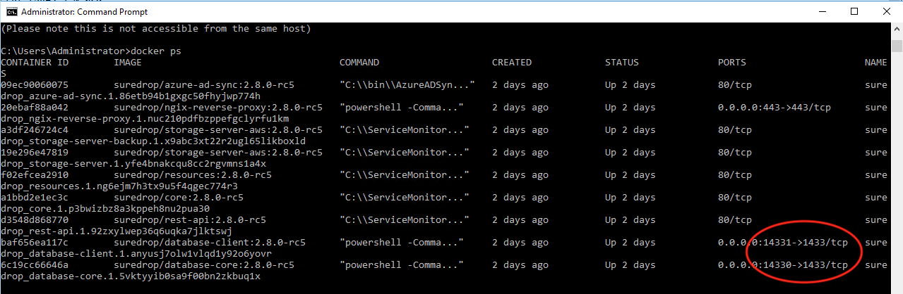

Backup a single stack deployment
================================

Backing up a single stack deployment of SureDrop involves the following
tasks:

1. Keeping a copy of your answers file
2. Backing up the block storage location
3. Backing up the MSSQL databases.

Backing up the block storage location
-------------------------------------

Backing up the block storage location is very straight forward.
Depending where you configured the Storage server location, this may
already be taken care of for you (eg. Amazon S3), or if your storage
location is an onsite SMB Windows file share, then make sure this
location is backed up to a separate location on a different server.

A simple XCOPY from a different host as follows would suffice:

.. code:: sh

    xcopy "\\server\\storage" D:\Backup /c /d /e /h /i /k /q /r /s /x /y

Where: The Suredrop block storage location is ``\\server``. The backup
destination on the remote server is D:.

This may be scheduled as a job on the remote server using
``schtasks.exe``.

Backing up the Databases
------------------------

Typing

.. code:: sh

    C:\> Docker ps

in an admin powershell in the SureDrop server will show something like the following:

As you can see, ports 14330 & 14331 have been left open specifically so
you are able to connect to the SureDrop SQL Server instances.

To set up a backup you will need to connect to these instances using
``MSSQL Server Administrator`` and the credentials in your answers.bat
file. Once connected it is a relatively simple task to set up a
scheduled backup to a remote location.
