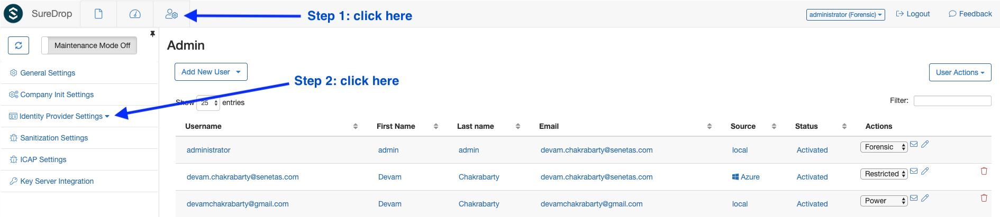
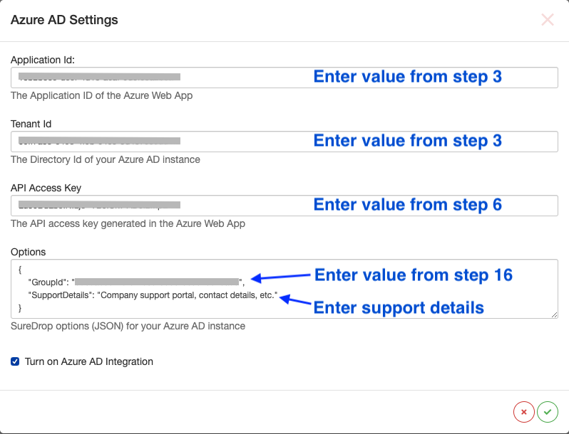
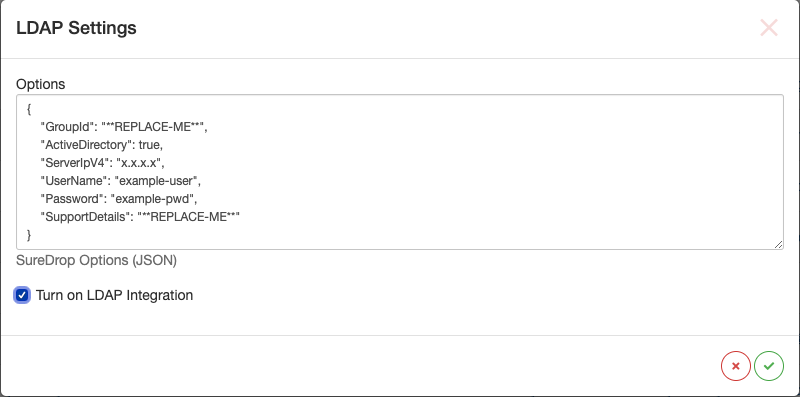
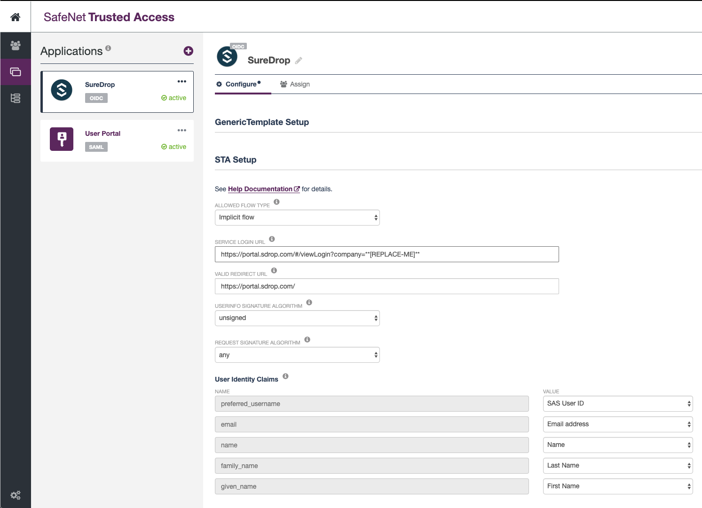

Identity Providers
==================

Contents
--------

-  `Introduction <#introduction>`__
-  `Azure AD Integration <#azure-ad-integration>`__
    -  `Setup Azure AD <#setup-azure-ad>`__
    -  `Setup SureDrop for Azure AD <#setup-suredrop-for-azure-ad>`__
-  `Windows Server Active Directory
   Integration <#windows-server-active-directory-integration>`__
-  `STA Integration <#sta-integration>`__
    -  `Setup STA <#setup-sta>`__
    -  `Setup SureDrop for STA <#setup-suredrop-for-sta>`__
-  `Known issues <#known-issues>`__

Introduction
------------

SureDrop can now be integrated with three identity providers for
single-sign-on, namely

-  `Microsoft Azure Active
   Directory <https://azure.microsoft.com/en-us/services/active-directory/>`__,

-  `Windows Server Active
   Directory <https://en.wikipedia.org/wiki/Active_Directory>`__ (using
   LDAP) and

-  `SafeNet Trusted
   Access <https://safenet.gemalto.com/access-management/idaas-safenet-trusted-access/>`__
   from Thales.

This feature can be turned on by the administrator (or a forensic user).
Once turned on, SureDrop will constantly poll the configured IDP every 2
minutes.

.. Note::
    IDPs are mutually exclusive. SureDrop does not
    support configuring multiple IDPs and the UI will prevent the users
    from this misconfiguration.

.. _aad:

Azure AD Integration
--------------------

This is a two step process. First the administrator needs to setup Azure
AD (creating users, groups, and an application) and then setup SureDrop
to synchronise with Azure AD.

Setup Azure AD
~~~~~~~~~~~~~~

If you already know how to setup Azure AD then you can skip this
section. Otherwise login to your `azure
portal <https://portal.azure.com>`__ and follow the steps below:

#. Click on :guilabel:`Azure Active Directory->App Registrations`. Then click on
   :guilabel:`New Application Registration`. For example if your AD name was
   SureDrop, then this step would be:

   .. figure:: ../images/2.10.0/Create-New-App.png
      :alt: Create New Azure Application

#. Give it a name, leave the :guilabel:`Supported Account types` as the default
   ``Accounts in this organizational directory only``. Then select
   application type of :guilabel:`Web` and paste your SureDrop URL into the
   ``Redirect URI (optional)`` (for example,
   ``https://198-162-250-3.xip.suredrop.com.au``). Microsoft will return
   the authentication response to this URI after successfully
   authenticating the user using `oAuth
   2.0 <https://docs.microsoft.com/en-us/azure/active-directory/develop/v1-protocols-oauth-code>`__.
   Finally, click the :guilabel:`Register` button at the bottom of the page.

   .. figure:: ../images/2.10.0/Register-new-application.png
      :alt: Register new application

#. Once the application is created successfully **Copy and save the
   ``Application (client) ID`` and Directory (tenant) ID** for later
   use, you will need this in the following section while configuring
   SureDrop.

   .. figure:: ../images/2.10.0/App+and+tenant+IDs.png
      :alt: App and Tenant IDs

#. Click on :guilabel:`Authentication` and then enter the same SureDrop URL
   (from step 1) in the ``Redirect URIs`` input box under the :guilabel:`Web`
   panel. After this, tick both the checkboxes for :guilabel:`Access tokens` and
   ``ID tokens`` under the ``Implicit Grant`` section.

   .. figure:: ../images/2.10.0/Authentication.png
      :alt: Authentication

#. Click on :guilabel:`Certificates & secrets` > :guilabel:`New client secret`
   button. In the popup window fill in a description like ``Key`` and choose
   ``Never`` in the ``Expires`` category. Then click on the :guilabel:`Add` button. 
   A client secret is a string that the application uses to prove its identity when
   requesting a token in the background.

   .. figure:: ../images/2.10.0/Client+secret.png
      :alt: Client secret

#. After successful generation of the key, please **copy the key value
   and store it someplace safe**. You will need this in the following
   section while configuring SureDrop (API Key).

   .. figure:: ../images/2.10.0/API+Key.png
      :alt: API Key

#. The next step is configure API permissions. Applications are
   authorised to use APIs by requesting permissions. These permissions
   show up during the consent process where users are given the
   opportunity to grant/deny access. To do this, click on
   :guilabel:`API permissions` > :guilabel:`Add a permission` button. From
   the slider on the right choose :guilabel:`Azure Active Directory Graph` under
   :guilabel:`Supported legacy APIs`.

   .. figure:: ../images/2.10.0/API+permissions.png
      :alt: API permissions

#. From the sliding right panel click on :guilabel:`Application permissions`,
   expand ``Directory`` and tick the checkbox for :guilabel:`Directory.Read.All`
   permission.

   .. figure:: ../images/2.10.0/Directory+read.png
      :alt: Directory read

#. Then click on :guilabel:`Delegated permissions` button on the left, expand
   User and tick the checkbox for ``User.Read`` permission. Finally,
   click on the :guilabel:`Add permissions` button to save the changes.

   .. figure:: ../images/2.10.0/User+read.png
      :alt: User read permissions

#. The API permission to read directory data (step 7 above) needs Azure
   AD administrator consent. So back in the API permissions click on the
   :guilabel:`Grant admin consent for <AD name>` > :guilabel:`Yes` in
   the popup confirmation dialog.

   .. figure:: ../images/2.10.0/Grant+consent.png
      :alt: Grant consent

#. After setting the necessary API permissions properly, the final
   screen should look similar to this -

   .. figure:: ../images/2.10.0/Final+screen.png
      :alt: Final screen

#. Click on :guilabel:`Manifest` and edit it to change
   ``oauth2AllowImplicitFlow`` to ``true``.

   .. figure:: ../images/2.10.0/Manifest.png
      :alt: Manifest

#. Edit the following URL and replace the TENANT\_ID, APPLICATION\_ID
   and SUREDROP\_URL\_FROM\_STEP\_2 then paste it into a browser:

   .. code:: text

       https://login.microsoftonline.com/[TENANT_ID]/adminconsent?client_id=[APPLICATION_ID]&state=12345&redirect_uri=[SUREDROP_URL_FROM_STEP_2]

   You will be asked to Log In to your Azure account.

#. Now we need create a root group for SureDrop synchronisation. To do
   this, click on :guilabel:`Home->Azure Active Directory` > :guilabel:`Groups`

   .. figure:: ../images/2.10.0/Azure+Groups.png
      :alt: Azure Groups

#. In the groups page, choose any existing group or create a new one to
   act as root for SureDrop.

   .. figure:: ../images/2.10.0/Root+group.png
      :alt: Root Group

#. You should now be in the specific group page which shows its
   ``Object ID``. This is an important identifier and please **copy and
   keep it somewhere safe**. You will need this while configuring
   SureDrop in the next section (Options blob).

   .. figure:: ../images/2.10.0/OID.png
      :alt: Object ID

Setup SureDrop for Azure AD
~~~~~~~~~~~~~~~~~~~~~~~~~~~

Once you've setup the Azure AD application, login to your SureDrop
instance as an administrator or forensic user. Click on the :guilabel:`Admin`
page and expand ``Identity Provider Settings``.

Then click on the Azure AD Integration sub-menu as shown in the picture
below -

.. figure:: ../images/2.10.0/Azure+AD.png
   :alt: Azure Active Directory

This will open a pop-up modal dialog where you'll need to enter the
``application ID``, ``tenant ID`` and ``API key`` from the previous
section; and a set of SureDrop JSON options for your Azure AD instance.
**Don't forget to tick the :guilabel:`Turn on Azure AD Integration` checkbox**
or none of it will work. The options should have
``{"GroupId":"**REPLACE-ME**", "SupportDetails":"**REPLACE-ME**"}``
filled in the input box. This is the root group which will be
synchronised to SureDrop. The GroupId is the ``object Id`` of the root
group in Azure AD.

So,

-  all users and groups which are members to this root group will be
   brought into SureDrop
-  the users will be added automagically to the relevant groups by
   default
-  if any changes are done to this root group in Azure AD, they will
   reflect in SureDrop within a preconfigured interval (currently set to
   2 minutes).

    Note: This feature is a one-way synchronisation. SureDrop pulls down
    information from Azure AD and updates itself, but **NEVER** alters
    the state of your Azure AD.

.. raw:: html

   

Windows Server Active Directory Integration
-------------------------------------------

SureDrop has the capability to connect and synchronise user and group
information from windows server AD or other directory services in your
domain controller using Lightweight Directory Access Protocol (LDAP).
This functionality is available from `version
2.6.0 <https://github.com/Senetas/SureDrop/wiki/Release-Notes---2.6.0>`__
onwards. It is a simple configuration in SureDrop. To enable this
synchronisation,

-  navigate to :guilabel:`Admin Settings` > :guilabel:`LDAP Integration` option. This will
   open a pop-up modal dialog where you'll need to **tick on the
   :guilabel:`Turn on LDAP Integration` checkbox**.

   .. figure:: ../images/2.10.0/LDAP.png
      :alt: LDAP

-  Fill in the LDAP options in the form of a JSON structure. In theory,
   the block should look like this -

.. code:: text

    {
      "GroupId": "**REPLACE-ME**",
      "ActiveDirectory": true,
      "ServerIpV4": "x.x.x.x",
      "UserName": "example-user",
      "Password": "example-pwd",
      "SupportDetails": "**REPLACE-ME**"
    }

.. important::

      **Don't forget to tick on the Turn on LDAP Integration checkbox.**

The ``GroupId`` for active directory must be the ``ObjectGUID`` for
the root group. Use the
`Get-ADGroup <https://docs.microsoft.com/en-us/powershell/module/addsadministration/get-adgroup?view=win10-ps>`__
powershell command to find the correct value. For example,
``Get-ADGroup -Identity SureDrop``

.. code:: sh

    DistinguishedName : CN=SureDrop,DC=Example,DC=com
    GroupCategory     : Security
    GroupScope        : DomainLocal
    Name              : SureDrop
    ObjectClass       : group
    ObjectGUID        : 02ce3874-dd86-41ba-bddc-013f34019978
    SamAccountName    : SureDrop
    SID               : S-1-5-32-544

.. Note::

   The Active Directory module for Windows PowerShell is a PowerShell
   module that consolidates a group of cmdlets. You can use these
   cmdlets to manage your Active Directory domains, Active Directory
   Lightweight Directory Services (AD LDS) configuration sets, and
   Active Directory Database Mounting Tool instances in a single,
   self-contained package. If you don't have the Active Directory 
   module installed on your machine, you need to download the correct 
   Remote Server Administration Tools (RSAT) package for your OS. 
   If you're running windows 7, you will also need to run the
   ``import-module ActiveDirectory`` command from an elevated
   PowerShell prompt.

.. raw:: html

   

.. _sta:

STA Integration
---------------

SafeNet Trusted Access has been integrated with SureDrop using
`OIDC <https://openid.net/connect/>`__ protocol. The configuration
(similar to Azure) is a two step process. First the administrator needs
to configure STA (create groups, users, an OIDC application) and then
configure SureDrop to connect to the IDP. SureDrop then downloads the
user information and allows SSO (single-sign-on) using STA.

Setup STA
~~~~~~~~~

If you know how to setup STA then please skip to the next section,
otherwise
`this <https://www.thalesdocs.com/sta/Content/STA/Ovrvw/Overview.htm>`__
is a good place to start reading about configuring STA.

#. `Add
   users <https://www.thalesdocs.com/sta/Content/STA/Users/AddUsrs.htm>`__
   in STA.

#. Add an internal group called SureDrop in STA and add the required
   users to this group. The documentation is given
   `here <https://www.thalesdocs.com/sta/Content/STA/Users/Groups.htm>`__.

#. Create an OIDC application in STA called SureDrop. You can customise
   this application according to your branding requirements, the only
   constraints are:

   -  the ``Allowed Flow Type`` must be set to :guilabel:`Implicit flow`.
   -  the ``User Info Signature Algorithm`` must be set to :guilabel:`unsigned`.
   -  the ``Request Signature Algorithm`` must be set to :guilabel:`any`.

   .. Tip::

      Append the SureDrop company name to the service login URL as shown in the snapshot below

   The documentation explaining all the parameters involved in this
   setup is given
   `here <https://www.thalesdocs.com/sta/Content/STA/Apps/AppsOIDC.htm>`__.

#. Finally, the STA administrator needs to create an API Key for
   SureDrop to communicate to STA. The process is described in `this
   page <https://www.thalesdocs.com/sta/Content/STA/API/APIs.htm>`__. It
   is **imperative** to save the API key and the ``Endpoint URL`` as
   you'll need them in the next step during configuring SureDrop.

   .. Note::

    **API keys are not stored on the STA Access Management
    console, and cannot be viewed or downloaded later. Make sure that
    you copy or download the API key, so that you can use it later.**

A typical setup would look similar to this:

Setup SureDrop for STA
~~~~~~~~~~~~~~~~~~~~~~

To open the STA Integration dialog go to the admin page. If the side-bar
menu is in normal state (not collapsed) then expand the Identity
Provider Settings menu and click on STA Integration menu. If the
side-bar menu is collapsed, then find the STA Integration menu shown by
a user collection icon (7th menu item from the top). This dialog will
appear with the following defaults

.. code:: text

    {
        "ClientId": "**REPLACE-ME**",
        "ClientSecret": "**REPLACE-ME**",
        "AuthEndpoint": "**REPLACE-ME**",
        "TokenEndpoint": "**REPLACE-ME**",
        "UserInfoEndpoint": "**REPLACE-ME**",
        "ConfigEndpoint": "**REPLACE-ME**",
        "RestApiDetails": {
            "Endpoint": "**REPLACE-ME**",
            "Key": "**REPLACE-ME**",
            "PageSize": 10
        },
        "SupportDetails": "**REPLACE-ME**"
    }

.. figure:: ../images/2.10.0/STA+Settings.png
   :alt: STA Settings

Replace the ``**REPLACE-ME**`` bits with the information displayed in
STA admin console, **tick on the Turn on STA Integration checkbox**
and click on the green tick icon. And that's it! Next time when a STA
user tries to login, SureDrop will federate the login via STA using
OIDC.

.. important::

    Please wait for a few minutes for the STA users to be imported to
    SureDrop. The synchronisation is done every couple of minutes but
    for the very first time it might take a little longer, depending on
    the number of users being imported and activated in SureDrop.

.. _sta-known-issues:

Known issues
~~~~~~~~~~~~

-  Avoid usernames with special characters (especially the at ``@``
   symbol) while adding users in STA. At this time users with such
   usernames cannot login to SureDrop due to a ``403 Forbidden Access``
   error.

-  If you update the username for a user in STA, it usually takes a
   couple of minutes to synchronise that information in SureDrop. When
   the updated user is available in SureDrop, it has been observed that
   the login fails in STA unless the end user uses a Private Browsing
   window (also known as Incognito mode).

-  When the end user initiates the login process from STA user portal,
   then he must enter his username in the SureDrop login page too.
