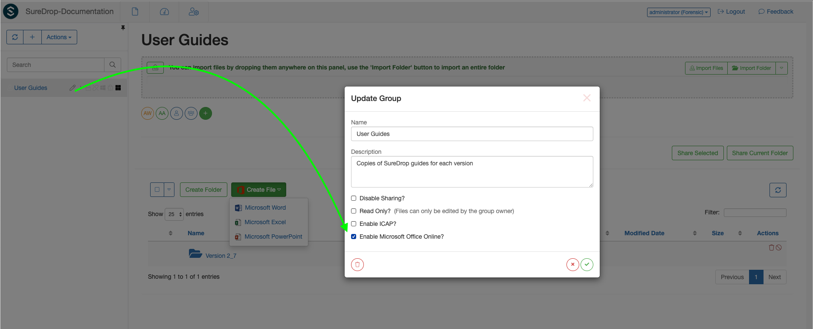
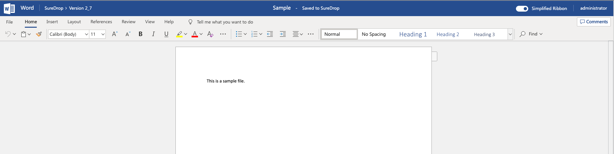

Office 365
==========

Contents
--------

-  `Introduction <#introduction>`__
-  `Business User <#business-user>`__
-  `Single Sign On <#single-sign-on>`__
-  `Deployment <#deployment>`__
-  `Known Issues <#known-issues>`__

Introduction
------------

We have partnered with Microsoft to enable SureDrop to be integrated
with the user's Office 365 account. Users can create and edit Word,
Excel and Powerpoint files in O365 from SureDrop. Users can also
collaborate in real time using either of these file types. Office for
the web supports multiple users editing a document at the same time.
Co-authoring in Office for the web includes real-time content updates
between all users editing the document, as well as present information
and real-time cursor tracking for each user.

Business User
-------------

When Office for the web is loaded for SureDrop users, it will check that
the user is signed in with an Office 365 business account, for example a
`Microsoft 365 Business Basic
License <https://www.microsoft.com/en-au/microsoft-365/business/microsoft-365-business-basic?activetab=pivot%3aoverviewtab>`__.
If the user is not signed in, they’ll be prompted to sign in

.. image:: https://wopi.readthedocs.io/en/latest/_images/business_user_flow_start.png
   :alt: Business User Flow 

Once signed in, Office for the web will verify that the user has a valid
Office 365 subscription. After this is verified, Office for the web will
automatically redirect the user back to SureDrop and the user can edit
documents. If the user has a valid Office 365 account but their
subscription does not include Office for the web, the user will see a
message that their subscription is insufficient.

.. image:: https://wopi.readthedocs.io/en/latest/_images/business_user_flow_unlicensed.png
   :alt: Business User Flow Unlicensed

.. important::
    **Please note that SureDrop users will need a valid Office 365
    license to use this integration. SureDrop license does not include
    Office 365 licenses by default.**

Single Sign On
--------------

Office 365 uses Azure Active Directory (Azure AD) to manage user
identities behind the scenes. Your Office 365 subscription includes a
free subscription to Azure AD so that you can integrate Office 365 with
Azure AD if you want to sync passwords or set up single sign-on with
your on-premises environment. You can also buy advanced features to
better manage your accounts.

If as a SureDrop administrator you have setup :doc:`Azure AD <IDP>`
as your identity provider then you can `associate your Office 365 license in your Azure AD
portal <https://docs.microsoft.com/en-us/azure/active-directory/fundamentals/license-users-groups>`__.

.. image:: https://docs.microsoft.com/en-us/azure/active-directory/fundamentals/media/license-users-groups/license-details-blade.png
   :alt: License details

Deployment
----------

This feature has been enabled for SureDrop's
`SaaS <https://portal.sdrop.com/#/viewLogin>`__ deployment instances at
the moment. Enabling Office 365 integration for on-prem installations
will require **at least 2-3 weeks** because Microsoft needs to whitelist
the URLs from which users will connect to Office 365 servers.

.. Warning::

   Microsoft does not whitelist xip certificates, so on-prem installations
   will need to configure PKI in SureDrop with a publicly accessible valid 
   X509 certificate. Once this is done share your SureDrop URL with your 
   SureDrop administrator and they can initiate the whitelisting process 
   with Microsoft.

.. _o365-known-issues:

Known Issues
------------

`Business user flow <https://github.com/microsoft/Office-Online-Test-Tools-and-Documentation/issues/139>`__
~~~~~~~~~~~~~~~~~~~~~~~~~~~~~~~~~~~~~~~~~~~~~~~~~~~~~~~~~~~~~~~~~~~~~~~~~~~~~~~~~~~~~~~~~~~~~~~~~~~~~~~~~~~

Office Online does not load properly after user sign-in when third-party
cookies are disabled. As part of the business user flow, users will be
asked to sign in using their Office 365 credentials. After sign-in, they
will be re-directed to SureDrop. However, if third-party cookies are
disabled, the Office Online application will fail to load because the
authentication cookie needed to verify the user has signed in
successfully with O365 is not sent along with the Office Online iframe
request.

Users must either **allow third-party cookies** or add
:guilabel:`\*.officeapps.live.com` to their browsers cookie allow list.

.. Note::
   In some browsers like Safari, third-party cookies are disabled by default.

In addition, browsers like Internet Explorer have a concept of 'zones'
which can change how cookies are handled (among other things). Ensure
all the sites in question are in the internet zone.

`PowerPoint Online <https://github.com/microsoft/Office-Online-Test-Tools-and-Documentation/issues/143>`__
~~~~~~~~~~~~~~~~~~~~~~~~~~~~~~~~~~~~~~~~~~~~~~~~~~~~~~~~~~~~~~~~~~~~~~~~~~~~~~~~~~~~~~~~~~~~~~~~~~~~~~~~~~

Download a Copy triggers browser pop-up blocker

In PowerPoint Online only, the Download a Copy action can trigger the
browser's pop-up blocker. Microsoft is

    working on a fix for this issue.

`Special characters in file name <https://github.com/microsoft/Office-Online-Test-Tools-and-Documentation/issues/158>`__
~~~~~~~~~~~~~~~~~~~~~~~~~~~~~~~~~~~~~~~~~~~~~~~~~~~~~~~~~~~~~~~~~~~~~~~~~~~~~~~~~~~~~~~~~~~~~~~~~~~~~~~~~~~~~~~~~~~~~~~~

Office Online will fail to load files with characters in the name that
are invalid in Windows

If a user's file name contains the following characters, the file will
not open properly in Office Online:

``\`` ``/`` ``:`` ``*`` ``?`` ``"`` ``<`` ``>`` ``|``

While Microsoft is evaluating fixes for this problem, SureDrop should
strip these characters from file names in order to open them in Office
Online.
