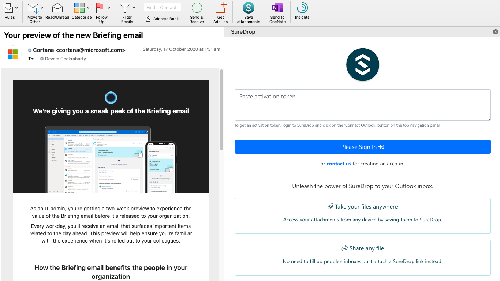
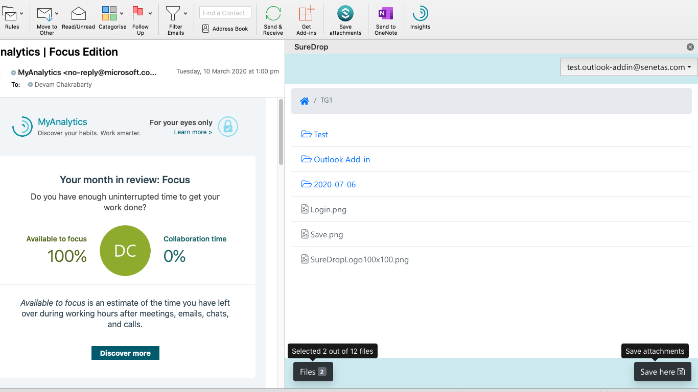

.. _outlook:

SureDrop for Outlook
====================

We have created an add-in that integrates with Microsoft Outlook in :ref:`version2-11-x`. 
By connecting the SureDrop add-in to your Outlook account, you can:

- Replace email attachments with a shared link to any file, big or small
- Save email attachments that you receive directly to your SureDrop account

Enabling the integration adds a SureDrop icon |suredrop-icon| to the Outlook compose window. 
When you click this icon a pop-up window appears, allowing you to select from the contents 
of your SureDrop. A shared link to any selected file or folder will appear in the body of the email.

While this link looks like an attachment, it's in fact a shared link. This means no slow-down in 
sending emails, and no space limitations in your inbox.

System requirements
-------------------

The SureDrop add-in for Outlook is available for email accounts hosted on Microsoft Exchange 2013 
or later. This is available on the following:

- Office 365
- Exchange Online
- On-premise installations

Therefore the add-in works with the following:

- Outlook on web
- outlook.com
- On Windows 10 and up, the SureDrop add-in is available on versions 2013 and 2016 of the Outlook desktop application
- On Mac, the SureDrop add-in is available on version 2016 of the Outlook desktop application

.. Warning::
    - Outlook on mobile, and older versions of Outlook on your desktop, are not supported.
    - POP/IMAP email accounts like Gmail are not supported.

.. |loc| raw:: html

   <a href="https://appsource.microsoft.com/en-us/product/office/WA200002317?tab=Overview" target="_blank">
   Microsoft’s AppSource listing for the SureDrop for Outlook add-in.</a>

.. _install-addin:

How to install the SureDrop add-in for Outlook
----------------------------------------------

   You will need to install the SureDrop for Outlook add-in through Microsoft’s AppSource 
   before you can use it.

        - Navigate to |loc|
        - Click :guilabel:`GET IT NOW`
        - Enter your Microsoft account credentials.
        - Click :guilabel:`Continue`
        - Click :guilabel:`Add`
        - Make sure the correct email account is selected. Then, click :guilabel:`Continue`
        - You’ll be brought to your Outlook account. Click :guilabel:`Install`
        - Click :guilabel:`OK`

        You’ll now see SureDrop |suredrop-icon| in your list of add-ins in your Outlook account.

Configure and use the SureDrop add-in for Outlook
-------------------------------------------------

Once you or your admin install the add-in, you’ll see the SureDrop add-in available for use with your email account 
on supported email clients. To get started, simply click |suredrop-icon| in the Outlook ribbon or email header to 
open the add-in, then sign into your SureDrop account.

#. As shown in the figure above, login to the add-in is a two-step process. First you need to login to SureDrop and
   click on the :guilabel:`Connect Outlook` button on the navigation bar. 
#. Then copy the activation token from SureDrop and paste it into the add-in's login form.

.. Tip::

    - If you’re unable to install the add-in, your IT admin may have add-ins restricted. Please contact your admin for help.
    - **Windows users** - The first time you use the add-in, some web browsers may display a security alert asking you to 
      allow the **Internet Low-Mic Utility Tool** to open content. Click :guilabel:`Allow` to use the add-in.

Attach a file from your SureDrop account to an email
----------------------------------------------------

#. When composing an email in Outlook, click the SureDrop icon to access your SureDrop account.
#. Select the files or folders you’d like to include in your email, or
#. Click on the user name and choose Upload files from the dropdown.
#. Click :guilabel:`Attach`; a shareable link is generated for each file or folder you select.

.. figure:: ../images/2.11/Attach.png
   :alt: Attach

Save an attachment to your SureDrop account
-------------------------------------------

#. When you receive an email with attachments, click the SureDrop button in the Outlook ribbon or email header.
#. Select the attachments you’d like to save to your SureDrop account.
#. Choose a location in your SureDrop to save the attachments, the default is ``My Documents``.
#. You can also create a new folder in SureDrop for saving your attachment by clicking on your user name 
   and choosing the :guilabel:`Create folder` option from the dropdown.

.. figure:: ../images/2.11/Saving.png
   :alt: Saving

Feedback
--------

Please try it and let us know if it enhances your SureDrop usability. You can directly send us your feedback by
clicking on your user name and choosing the :guilabel:`Feedback` option from the dropdown.
