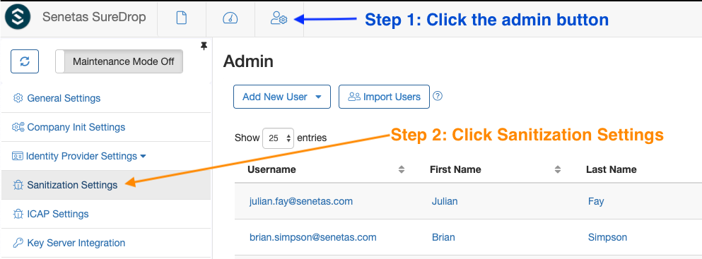
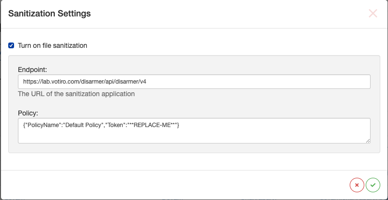
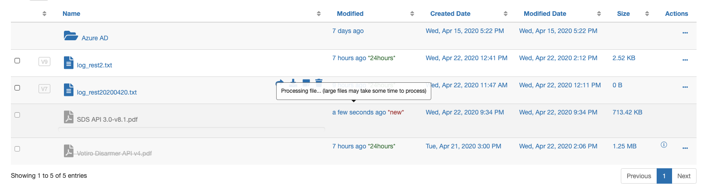
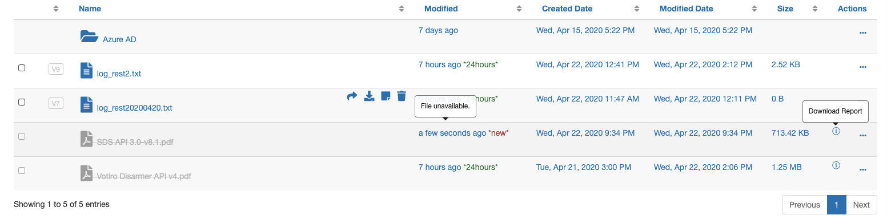

Votiro
======

Introduction
------------

SureDrop file sanitization (by Votiro) is a feature which can be enabled
by **the administrator** (or a **forensic user**). Once turned on, the
administrator must also configure the API endpoint and scan policy
including at least the policy name and a security token. After this any
file uploaded to SureDrop will be sanitized asynchronously in the
background. This feature can similarly be toggled off at any time by the
administrator.

Feature toggle
--------------

To enable or disable file sanitization, open the Sanitization Settings
from within Admin Page -

Configuration
-------------

On enabling this command will open a modal window to configure the
sanitization settings -

The policy must be a valid JSON snippet as this will be sent to Votiro
in the file sanitization request. Remember to replace the
:guilabel:`**REPLACE ME**` with the actual security token key within double
quotes otherwise all sanitization requests will fail with Access Denied
(401) error. For example-

.. code:: text

    {"PolicyName":"Default Policy","Token":"**REPLACE-ME**"}

.. Tip::
    **For creating a token see the Votiro Disarmer User Guide,
    Configuring System Settings.**

File upload
-----------

After enabling this feature, any file that is uploaded to SureDrop will
be displayed in grey colour while it is being sanitized asynchronously
in the background. Hovering your mouse on the row will display a tooltip
indicating that the file is being processed.

Once sanitization completes the user table will be refreshed
automatically unless the user has manually changed the path by clicking
some other part of SureDrop.

Sanitization result
-------------------

If sanitization succeeds then after refreshing the document list the
document will be available for download just any any regular file.

If however, the sanitization fails (or the file gets blocked) then the
file will be displayed in grey colour with a strikeout on the filename
and hovering your mouse on the row will display a tooltip indicating
that the file is not available for download. The user can either

-  download the sanitization report
-  delete/purge the document (depending on this role permissions)
-  re-upload the same file after checking the scan policy with the
   administrator

Conclusion
----------

File sanitization can (and probably will) take quite some time depending
on several factors such as the file size, the sanitization policy etc.
That's why the feature is designed to be asynchronously done in the
background without blocking the user. It is a completely optional
feature and can be turned off at any time. We hope you enjoy using this
feature as much as we enjoyed developing and delivering it!
