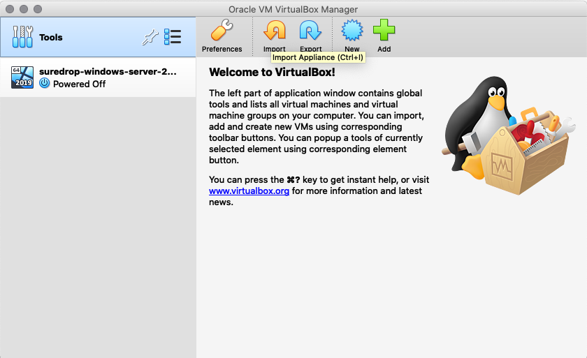
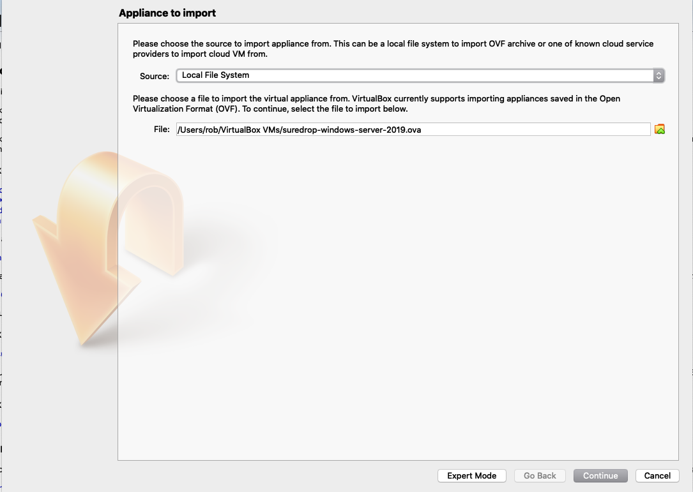

New Install - Windows 2019 Virtual Machine
==========================================

Before starting this install you will need to contact support and obtain
the following:

   a) Username
   b) Password
   c) Activation Key
   d) The Version of SureDrop to Install
   e) A share pointing to the location of the Virtual Box appliance
   f) The password for the appliance

.. admonition:: Prefer watching over reading?

   Check out `this <https://youtu.be/GTRl6cFH9jQ>`_ screencast video.
   
   .. raw:: html
   
       

       <iframe width="100%" height="350" src="https://youtu.be/iymHek_5MPU" frameborder="0" allow="autoplay; encrypted-media" allowfullscreen></iframe>
       

#. Download the Virtual Box Appliance from the share provided.

	This appliance is an .ova file about 13Gb in size.

#. While the ova is downloading install Oracle Virtual Box from the following location.

	.. code:: sh

	 https://www.virtualbox.org/wiki/Downloads
		
#. After you have installed Virtual Box and downloaded the .ova file, import the appliance.

