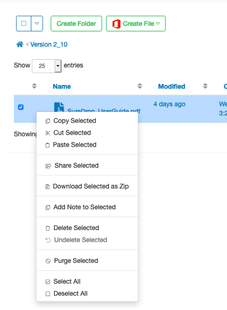

Delete files
============

Single or multiple files can be deleted or purged from SureDrop using the right-click or action menus.

Deleted files are removed from view but are retained in the system and can be undeleted by group owners and administrators. 

.. note::
    Purging is a harder delete; a purged file is removed from the group but remains 
    in the system and can only be seen or unpurged by a ‘Forensic’ user.

As of this FAQ date there is no permanent hard delete ability, this capability is being added to the next major release.

