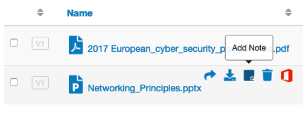
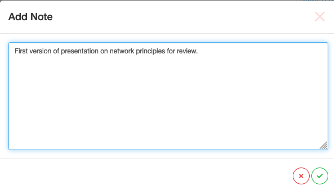
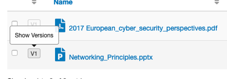
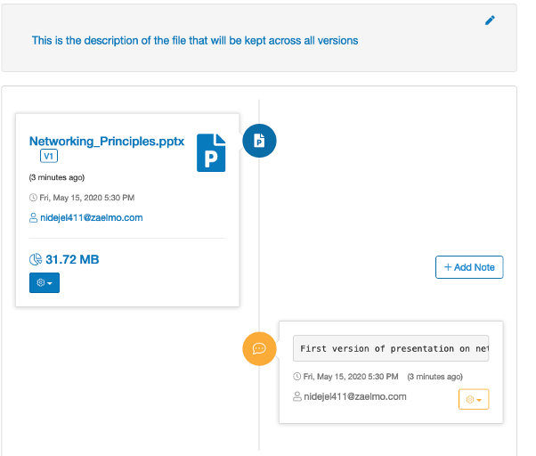

File note
=========

A text note can be added to any file using the Add Note button next to each file:

File notes are shown on the file information screen which is accessible from the 
``Show Versions`` button next to each file or from the ``Info`` menu item accessible 
from the ellipsis at the end of each filename.

.. tip::
    File notes are associated with a particular file version, more than one note can be 
    created for each version and a description of the file for all 
    version can also be created.

