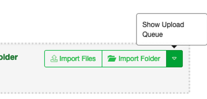
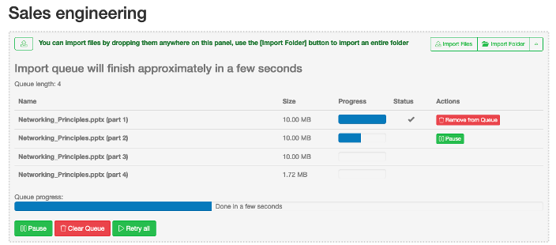

File upload queue
=================

SureDrop breaks uploaded files into small chunks to maximise the upload speed.
The chunk size depends on the file size as follows:

+---------------------------------------------------+------------+
| File size                                         | Chunk size |
+===================================================+============+
| Greater than 10 MB but less than or equal to 1 GB | 10 MB      |
+---------------------------------------------------+------------+
| Greater than 1 GB but less than or equal to 10 GB | 100 MB     |
+---------------------------------------------------+------------+
| Greater than 10 GB                                | 500 MB     |
+---------------------------------------------------+------------+

During the file upload the upload queue is normally hidden but can be viewed by 
clicking on the “Show Upload Queue” button.

In the unlikely event that a file chunk fails to upload the action button allows 
you to pause/restart or remove the chunk from the queue:

