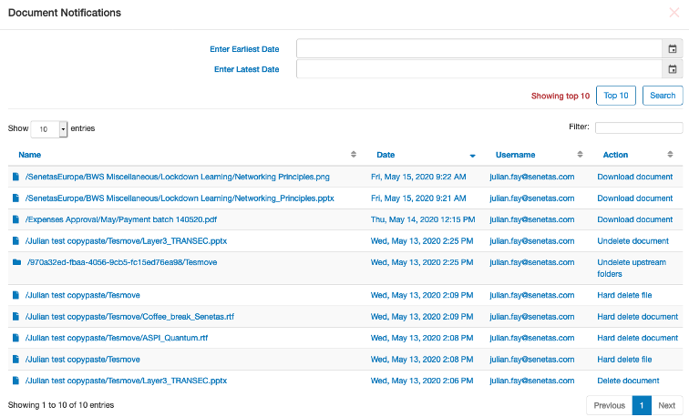
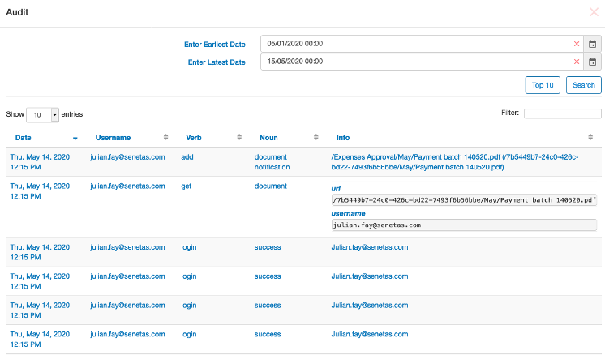

The difference between Audit notifications and Document notifications
=====================================================================

Document notifications show a record of all file and document activities 
including uploads, downloads, moves and deletes etc.

The Audit log is a record of all system activity including document notification, 
other file activity and user logins etc.

.. tip::
   SureDrop supports external audit log servers such as `Syslog <https://en.wikipedia.org/wiki/Syslog>`_
   and `Splunk <https://www.splunk.com/>`_ for on-premises deployments.
