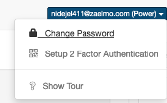
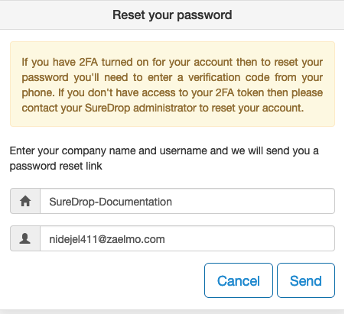

Reset Password
==============

Local users can change their passwords themselves from the Web GUI:

Local users who have forgotten their passwords can reset it by clicking 
the ``Forgot Password`` link on the login page, they will then be prompted 
to reset their password.

.. note::

    Federated users need to change their passwords through their configured identity provider.