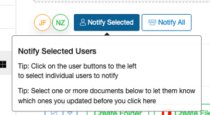

The difference between Notifications and Sharing
================================================

Notifications are messages sent to enrolled SureDrop users intended to inform them that files have been updated.
They are sent as emails to the enrolled users inviting them to login to SureDrop to take a look at the updated files.

Sharing on the other hand, allows files to be shared with external (non enrolled) users.