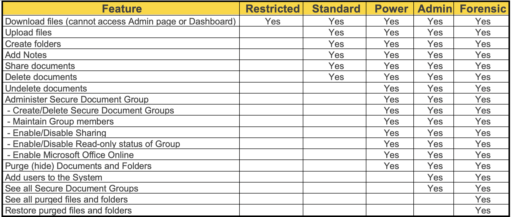

RBAC
====

SureDrop has full Role Based Access Control (RBAC).  There are five user roles as follows:

1. **Restricted** – Can download files only
2. **Standard** – Can upload and download files
3. **Power** – Can also create new security groups and invite other users to them
4. **Admin** – System administrator
5. **Forensic** – Special role that can reinstate purged files

