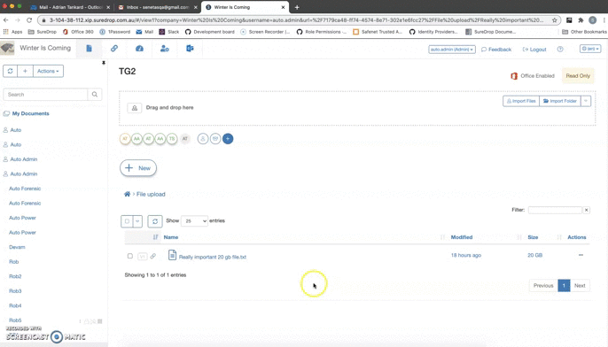
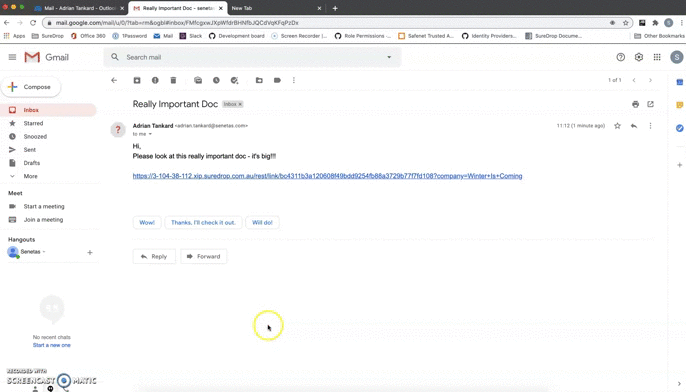
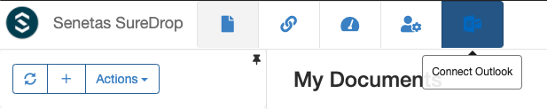
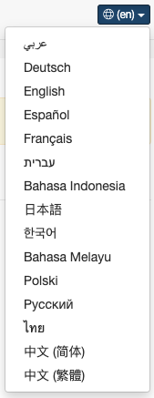
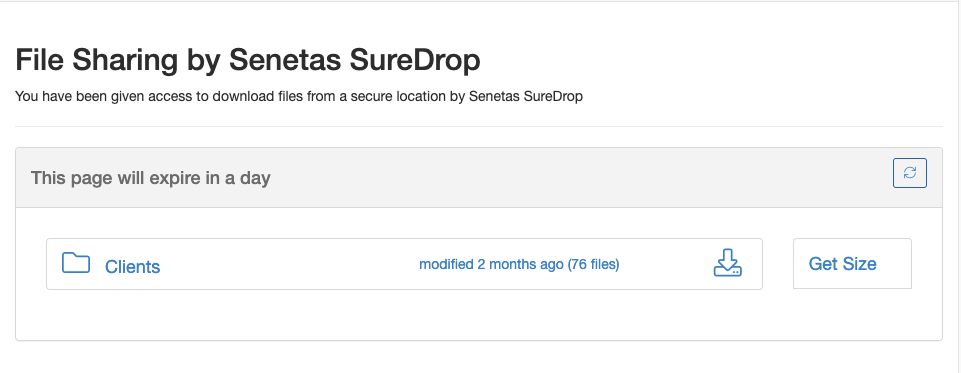
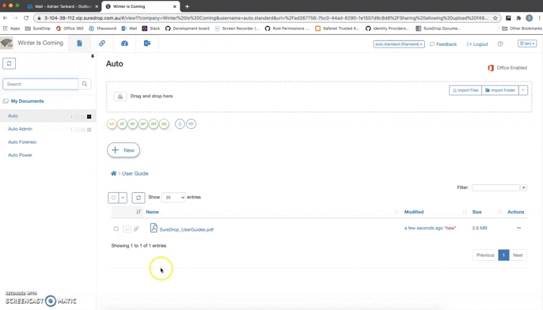
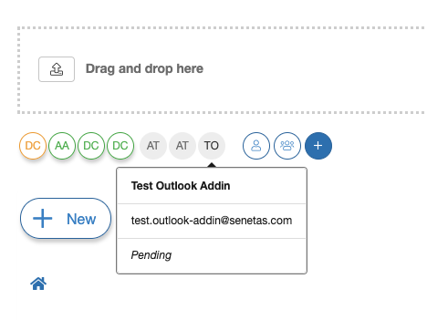

.. _version2-11-x:

Version 2.11.x
==============

.. admonition:: Welcome to the September 2020 release of SureDrop version 2.11.0

   There are a number of updates in this version that we hope you will like, along with making intangible security changes
   and minor bug fixes, these are the new features implemented in this version:

-  `Shareable links <#shareable-links>`__ - users are now able to share publicly accessible links to files and folders.
-  `Outlook integration <#outlook-integration>`__ - SureDrop add-in for Outlook allows you share links and save attachments 
   directly from Outlook to SureDrop.
-  `Ρусский <#suredrop-in-russian>`__ - SureDrop i18n now includes Russian.
-  `Download as zip <#download-as-zip>`__ - users can now download files and folders as a zip archive on the fly.
-  `Notifications with message <#notifications-with-message>`__ - we are now able to add a custom message to SureDrop notification.
-  `Group membership badge <#group-membership-badge>`__ - pending users are displayed in the UI as inactive members of the group.
-  `Changes to MFA <#changes-to-mfa>`__ - administrators can now view, filter and sort users based on MFA.
-  `Folder size <#folder-size>`__ - users can now view a folder size on demand.
-  `Restricted users <#restricted-users>`__ - do not have access to a ``My Documents`` group.

.. important::
   Please run the following command to download the latest install script:

   .. code:: sh

      wget "https://s3-ap-southeast-2.amazonaws.com/suredrop-downloads/compose/create-suredrop.bat" -outfile "create-suredrop.bat"

Features / enhancements implemented
-----------------------------------

Shareable links
~~~~~~~~~~~~~~~

A link is a simple, fast and easy way to share a file or folder with anyone. They do not have any options and recipients of links 
must create a SureDrop login to access them (for security purposes). These are :ref:`links-vs-shares` in SureDrop.

Getting a link
______________

Receiving a link
________________

Outlook integration
~~~~~~~~~~~~~~~~~~~

We have now created an add-in that integrates SureDrop with Microsoft Outlook. By connecting the SureDrop add-in to 
your Outlook account, you can:

- Replace email attachments with a shared link to any file, big or small
- Save email attachments that you receive directly to your SureDrop account 

The details of connecting Outlook with SureDrop can be found in the :ref:`outlook` page.

SureDrop in Russian
~~~~~~~~~~~~~~~~~~~

Our i18n is now extended to support Russian locale. That means we now officially support the following lanugages -

Download as zip
~~~~~~~~~~~~~~~

SureDrop files and folders can now be downloaded as a zip archive on-the-fly. That means the archive is created on-demand 
totally asynchronously and does not buffer any intermediate files in memory. It is a completely transparent operation to
the end user and provides the ability to share folders including sub-folders, a much awaited feature in SureDrop.

Notifications with message
~~~~~~~~~~~~~~~~~~~~~~~~~~

We can now include a note / message along with the ``Notify Selected`` and ``Notify All`` operations. This was a feature
request to standardise adhoc sharing and notification workflows. 

Group membership badge
~~~~~~~~~~~~~~~~~~~~~~

When a user yet to activate his SureDrop account is added to a group, his membership is shown in the GUI as an inactive
badge. The user details can be viewed as a tooltip on hover.

Changes to MFA
~~~~~~~~~~~~~~

- SureDrop multi-factor authentication has now been restricted local users only. All external (federated) users will 
  manage their MFA with the respective identity provider (Azure, LDAP or STA). 

- SureDrop administrators can now view, filter and sort users based on their MFA.

- Turning on MFA company wide now prompts the administrators about resetting local user accounts which don't have 
  MFA turned on.

Folder size
~~~~~~~~~~~

Users can now view folder sizes on demand by clicking the ``Get Size`` button. The functionality has been extended
to folders shown in documents, links and adhoc sharing pages.

  .. image:: /images/2.11/FolderSize.png

Restricted users
~~~~~~~~~~~~~~~~

- With the advent of zipping files on-the-fly, we have removed the ``My Documents`` group for restricted users. The 
  only reason for that group to exist for restricted users, was to act as a destination for zipped files. This is no
  longer required. 

- The link and shares page looks a bit different for restricted users. They are not authorised to view sent links and
  shares.

Minor Releases
--------------

Version 2.11.1 - 21st September 2020
~~~~~~~~~~~~~~~~~~~~~~~~~~~~~~~~~~~~

- **Downloading folder (cloud)** - There was a configuration error in the Canberra region of our 
  `SaaS <https://portal.sdrop.com/#/viewLogin>`_ instance. This leads to failure in downloading 
  folders. 

- **Outlook addin documentation** - The link in the Connect Outlook dialog in SureDrop, now points at
  :ref:`install-addin`.

.. raw:: html

   

Version 2.11.2 - 22nd September 2020
~~~~~~~~~~~~~~~~~~~~~~~~~~~~~~~~~~~~

- **Get Link using Safari** - we have had to change some code to support ``Get Link`` operation in Safari. 

- **Icon sizes** - we have slightly modified the icons in file and folder view to standardise it with other pages.

- **Changing language on adhoc sharing page** - was redirecting the user to the login page. 

- **Sharing password** - using the browser's auto-fill functionality for email addresses, was also populating
  the password field as well.

.. raw:: html

   

Version 2.11.3 - 29th September 2020
~~~~~~~~~~~~~~~~~~~~~~~~~~~~~~~~~~~~

- **Get Link using Safari** - More minor changes to support Safari and the clipboard. 

- **Sharing View** - In some cases files were not shown in the ``Share View`` unless the user selected the ``File View`` then went back to the ``Share View``.

- **File Name Truncated in File View** - Long file names were truncated in the ``File View``. 
  Filenames now use the full column width and show in the tooltip. 
